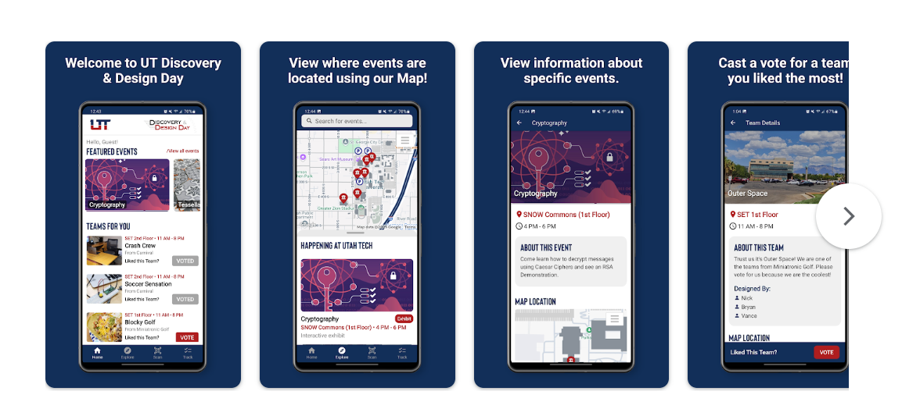

# s25_senior_project
This repository will contain the code for the UT Discovery & Design Day mobile application for my senior capstone at Utah Tech University.

This mobile application will be developed for Utah Tech University, specifically for Discovery & Design Day. 

The purpose of this app is to overall enhance the Design Day experience for the community. 

## Figma Wireframes and Designs

Here are the designs that I came up with before implementing the mobile application. Heavily inspired by the Eventbrite Mobile Application

[Low-Fideliy Wireframes](https://www.figma.com/design/tcFL5t3Xs84EeMvfZYwofO/UT-DesignDay-Low-Fidelity?node-id=2-8&t=M8kzi61vVsPsS0bp-0)

[High-Fidelity Prototype](https://www.figma.com/design/XmG5wkMY6Q9FNXnFN8V4Wn/UT-DesignDay-High-Fidelity?node-id=1-2&t=hjxFyyyY96yoHxAp-0)

## Download the App for Google and Apple App Stores

[Get it on Google Play Stores](https://play.google.com/store/apps/details?id=edu.utahtech.discoverydesignday)

[Get it on Apple App Stores](https://apps.apple.com/us/app/ut-discovery-design-day/id6744318847)

